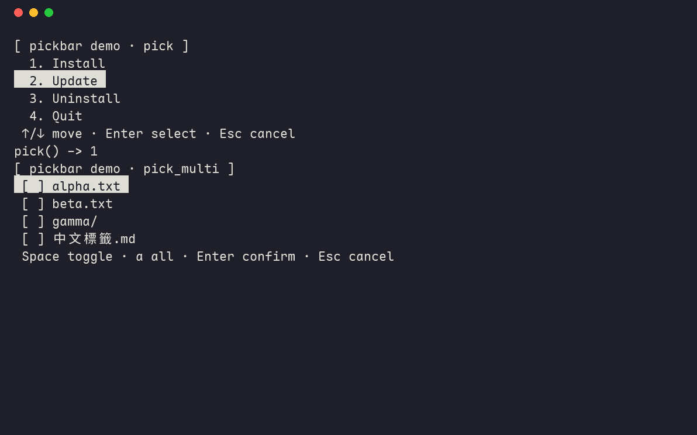

# pickbar

**Zero-dependency highlight-bar menus for the terminal. One file, Windows and
POSIX, CJK-safe.**

[繁體中文](README.zh-TW.md)



The highlight bar: the way BBS-era software felt. A reverse-video bar you
drive with the arrow keys, digits to jump, Enter to commit. `pickbar` brings
that to Python scripts with zero dependencies, a single module, and three
functions:

```python
from pickbar import pick, pick_multi, pick_dir

i = pick(["Install", "Update", "Exit"], title="[ setup ]")
# -> selected index, or None on cancel

idxs = pick_multi(["a.txt", "b.txt", "c/"], title="Select files:")
# -> selected indices (Space toggles, 'a' all), or None on cancel

path = pick_dir("Choose a directory:", allow_create=True)
# -> browse with type-to-filter, '/' or '~' jumps to a path
```

Try it: `python -m pickbar`

```
[ setup ]
   1. Install
▌  2. Update                                                                 ▐
   3. Exit
 ↑/↓ move · Enter select · Esc cancel
```

## Why another menu library

The existing options make you choose two of three:

- Zero-dependency pickers (`simple-term-menu`, `pmenu`) do not support
  Windows; the former documents Linux and macOS only.

- Windows-capable prompt kits (`InquirerPy`, `beaupy`, `questionary`) pull in
  `prompt_toolkit` or `rich` and their dependency trees.

- East-Asian text breaks alignment in most of them; `console-menu` has
  known CJK display problems on Windows via `windows-curses`.

`pickbar` does all three at once: standard library only, Windows VT and
POSIX termios both handled natively, and every clip and pad computed by
display width (`unicodedata.east_asian_width`), so `中文` and `日本語`
labels line up with ASCII ones, on Windows included.

It also degrades honestly: when stdin/stdout is not a TTY (pipes, cron, CI)
or the terminal cannot do ANSI, every menu falls back to a classic numbered
`input()` prompt with the same return contract, so scripts using pickbar
stay scriptable.

## Install

```sh
pip install pickbar
```

Or vendor it: copy `pickbar.py` into your project. It is one file with no
imports outside the standard library; that is the point.

Requires Python 3.8+.

## API

### `pick(options, title=None, *, index=0, keys=None, footer=None)`

Single choice. Returns the selected index (`int`), a `keys` value, or `None`
on cancel.

- `options`: list of labels; anything `str()`-able. Multi-line labels work.
- `index`: initially highlighted row.
- `keys`: `{char: value}` hotkeys; pressing the char returns the value.
- `footer`: hint line under the list (a default explains the keys).

Keys: `↑`/`↓` move (wraps), digits jump the bar (Enter confirms; typing a
number never selects directly, to avoid mis-picks), `Home`/`End`, `Enter`
select, `Esc`/`q`/`0` cancel. Ctrl-C raises `KeyboardInterrupt`, same as
`input()`.

### `pick_multi(options, title=None, *, footer=None)`

Multi-select. `Space` toggles the highlighted row (and advances), `a`
toggles all, `Enter` confirms, `Esc`/`q` cancels. Returns selected indices
in list order (possibly empty), or `None` on cancel.

### `pick_dir(title=None, start=None, allow_create=False)`

Filesystem browser. Typing filters the entries (case-insensitive); a query
starting with `/` or `~` jumps straight to that path. `allow_create` offers
"new subdirectory here"; the directory is not created, the would-be path is
just returned so callers can mkdir on apply. Returns the chosen path as
`str`, or `None` on cancel.

## Behavior notes

- Long lists scroll in a viewport sized to the terminal, with `↑`/`↓`
  overflow markers; the viewport grows around the highlighted row, so
  multi-line labels are handled correctly.

- The terminal is held in cbreak for the whole menu (POSIX) so fast
  keypresses never echo garbage or leak arrow sequences to the shell; the
  cursor is hidden during the menu and always restored.

- On Windows, VT processing is enabled via `SetConsoleMode`; if that fails
  (very old consoles), the numbered fallback is used automatically.

## License

MIT
